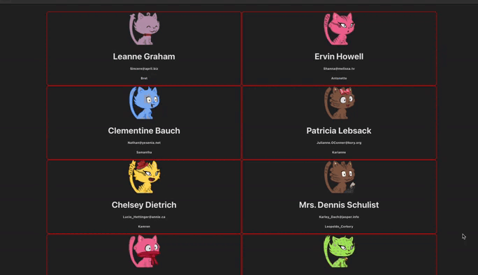

# User Cards App

This is a simple React application that fetches a list of users from a public API and displays them as animated cards with unique avatar images.

---

## 📸 Live Demo


---

## 🚀 Features

- Fetches users from `https://jsonplaceholder.typicode.com/users`
- Displays users in stylish, hover-animated cards
- Dynamic robot avatars from [robohash.org](https://robohash.org)
- Hover animation with scaling and flipping effect 

---

## 🧱 Project Structure

```
src/
├── App.jsx            # Main app logic, fetch & render users
├── App.css            # Global styles
├── components/
│   └── User.jsx       # User card component
public/
└── index.html         # HTML entry
```

---

## 🧑‍🎨 Avatar Images

Each user's image is dynamically generated using:

```
https://robohash.org/{username}.png?set=set4
```

This creates a unique **cat avatar** (`set4`) for each user based on their name.

---

## 📦 Installation & Running

```bash
# Clone the repo
git clone https://github.com/Shuaa-99/User-Cards-App
cd User-Cards-App

# Install dependencies
npm install

# Start development server
npm run dev
# or
npm start
```

Then open your browser at: [http://localhost:3000](http://localhost:3000)

---

## 📌 Notes

- The `User` component receives a `user` object and renders:
  - Name
  - Email
  - Username
  - Avatar image
- Animations are handled using simple CSS transitions
- Styling is defined in `App.css` and component-level styles

---

## 🛠️ Technologies Used

- ⚛️ React (with hooks)
- 🧠 useState / useEffect
- 🎨 CSS3
- 🔗 JSONPlaceholder API
- 🐱 Robohash.org avatars
